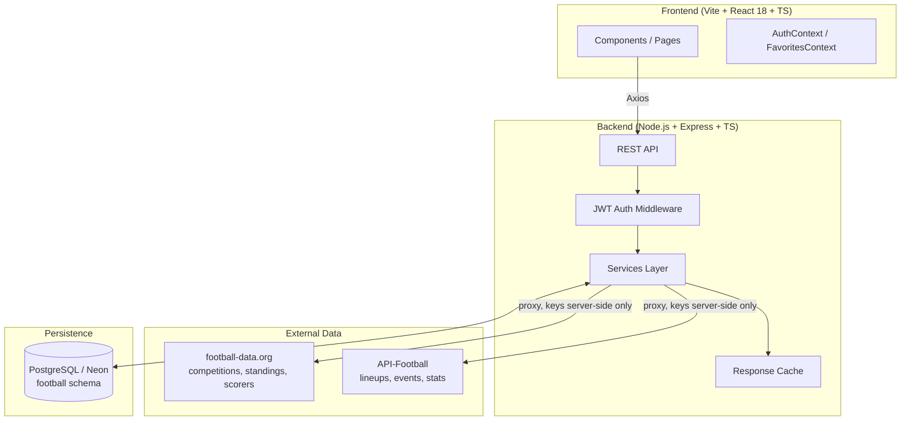

# ⚽ Football Stats Tracker

[](https://www.typescriptlang.org/)
[](https://react.dev/)
[](https://nodejs.org/)
[](https://neon.tech/)
[](https://www.prisma.io/)

A full-stack, Arabic-first football companion. Browse competitions and their
**matches**, **standings**, and **top scorers**; drill into a match for
**lineups, events, and live statistics**, or a player for **season stats**;
and — once signed in — save favorite teams and players to a personalized
dashboard.

---

## Why this project is more than a CRUD app

Most beginner "sports tracker" projects wrap a single free API and call it a
day. This one solves a real integration problem: **no single free football
API gives you everything.**

| What you need | Provider that has it | Limitation |
|---|---|---|
| Competitions, standings, scorers, current-season matches | football-data.org | No lineups, events, or match statistics at any free tier |
| Lineups, goal/card events, match/player statistics | API-Football (RapidAPI) | Free tier historically capped at older seasons (2021–2023); no shared ID with football-data.org |

**The engineering problem:** two providers, no common identifier between
them, and a UI that has to stay useful even when enrichment data is
unavailable.

**The solution implemented here:** the backend proxies both providers
server-side (API keys never reach the browser), and match/player enrichment
uses **best-effort fuzzy matching** (team names + date) to bridge the two
data sources. When no confident match is found — wrong season, unsubscribed
key, or no fuzzy match — the UI degrades gracefully to "unavailable" instead
of breaking the page. The base info from football-data.org is always shown
regardless.

This is the kind of resilience real production systems need when they
depend on third-party APIs with incomplete coverage.

---

## Architecture



**Key design decisions:**

- **Server-side key isolation** — both `FOOTBALL_DATA_KEY` and
  `APIFOOTBALL_KEY` live only in `backend/.env`. The frontend never talks to
  either provider directly; it only ever calls the Express proxy.
- **Dedicated Postgres schema** (`football`, via Prisma `multiSchema`) so
  the database can be safely shared with other apps without table
  collisions.
- **Neon serverless driver over HTTPS/WebSocket** instead of raw TCP 5432 —
  required for networks without IPv6 reachability to Neon, and compatible
  with Neon's connection pooler.
- **Response caching** on the football proxy routes to respect each
  provider's free-tier rate limits.

---

## Features

- 🌍 **Arabic-first UI** — `<html lang="ar" dir="rtl">` by default
- 🔐 **JWT authentication** — register, login, session persistence
- ⭐ **Favorites system** — save favorite teams and players, dedicated
  favorites dashboard
- 📊 **Live match details** — lineups, pitch visualization, goal/card
  events, match statistics (when available)
- 👤 **Player profiles** — season stats pulled from whichever provider has
  them
- 🏆 **Competitions, standings, and top scorers** across supported leagues

---

## Tech Stack

| Layer | Stack |
|---|---|
| Frontend | Vite, React 18, TypeScript (strict), Tailwind CSS, Axios, React Router |
| Backend | Node.js, Express, TypeScript, JWT, bcryptjs, Zod |
| Database | PostgreSQL (Neon) via Prisma ORM + Neon serverless adapter |
| Data APIs | football-data.org v4, API-Football (RapidAPI) — both proxied server-side |

---

## Project Structure

```
Football_info/
├── frontend/            # Vite + React (+ react-router-dom) app
│   └── src/
│       ├── api/         # http (backend client), footballApi, authApi, favoritesApi
│       ├── components/  # CompetitionSelect, MatchesList, StandingsTable, TopScorers,
│       │                # MatchCard, PitchVisualization, ...
│       ├── context/     # AuthContext, FavoritesContext (teams + players)
│       ├── pages/       # HomePage, Profile, MatchDetails, PlayerDetails
│       ├── utils/       # date formatting
│       └── types/       # football.ts, auth.ts
├── backend/              # Express + JWT API + football-data.org/API-Football proxy
│   ├── prisma/           # schema.prisma, init.sql
│   └── src/
│       ├── config/       # env validation, prisma (Neon adapter), dbUrl
│       ├── controllers/  # auth, favorites, football, matchDetails, player
│       ├── middleware/   # auth guard, error handler
│       ├── routes/       # auth, favorites, football, index
│       ├── services/     # auth, favorites, footballData, apiFootball
│       └── utils/        # jwt, password, ApiError, cache
├── docs/                 # diagrams.md (Mermaid: use-case, class, ERD)
└── README.md
```

---

## Getting Started

### 1. Frontend

```bash
cd frontend
npm install
cp .env.example .env      # VITE_API_BASE_URL only — no data-API key here
npm run dev                # http://localhost:5173
```

Required env (`frontend/.env`):

| Variable | Description |
|---|---|
| `VITE_API_BASE_URL` | Backend URL, e.g. `http://localhost:4000/api` |

### 2. Backend

```bash
cd backend
npm install
cp .env.example .env       # then set DATABASE_URL + JWT_SECRET
npm run prisma:generate    # generate the Prisma client
npm run db:push:neon       # create tables in the `football` schema
npm run dev                 # http://localhost:4000
```

Required env (`backend/.env`):

| Variable | Description |
|---|---|
| `DATABASE_URL` | Neon Postgres connection string (`&schema=football` suffix) |
| `JWT_SECRET` | Strong random secret for signing tokens |
| `JWT_EXPIRES_IN` | Token lifetime, e.g. `7d` |
| `FOOTBALL_DATA_KEY` | football-data.org API key |
| `APIFOOTBALL_KEY` | RapidAPI key for API-Football (free Basic plan works) |
| `APIFOOTBALL_HOST` | RapidAPI host header for API-Football |
| `PORT` | Backend port (default `4000`) |
| `CLIENT_ORIGIN` | Frontend origin for CORS |

> Without `APIFOOTBALL_KEY`, match/player enrichment always shows
> "unavailable" gracefully — it never errors out or breaks the page.

#### Database notes (Neon)

- **Neon serverless driver** — the backend connects via `@prisma/adapter-neon`
  over HTTPS/WebSocket (port 443) instead of raw TCP 5432, required on
  networks that can't reach Neon over IPv6.
- **Dedicated schema** — all tables live under `football` (Prisma
  `multiSchema`) so they never collide with other apps sharing the database.
- **Creating tables** — `npm run db:push:neon` applies `prisma/init.sql` via
  the Neon driver. Alternatively, paste `init.sql` into the Neon Console →
  SQL Editor. (`prisma migrate`/`db push` won't work on IPv6-less networks
  since they use TCP 5432.)

---

## API Endpoints

| Method | Path | Auth | Description |
|---|---|---|---|
| POST | `/api/auth/register` | — | Create account, get token |
| POST | `/api/auth/login` | — | Login, get token |
| GET | `/api/auth/me` | ✅ | Current user |
| POST | `/api/auth/logout` | ✅ | Logout (client drops JWT) |
| GET | `/api/favorites/teams` | ✅ | List favorite teams |
| POST | `/api/favorites/teams` | ✅ | Add favorite team |
| DELETE | `/api/favorites/teams/:id` | ✅ | Remove favorite team |
| GET | `/api/favorites/players` | ✅ | List favorite players |
| POST | `/api/favorites/players` | ✅ | Add favorite player |
| DELETE | `/api/favorites/players/:id` | ✅ | Remove favorite player |
| GET | `/api/football/competitions` | — | List competitions |
| GET | `/api/football/competitions/:code/standings` | — | League table |
| GET | `/api/football/competitions/:code/scorers` | — | Top scorers |
| GET | `/api/football/competitions/:code/matches` | — | Competition matches |
| GET | `/api/football/teams/:id/matches` | — | A team's matches |
| GET | `/api/football/matches/:id` | — | Match detail + best-effort lineups/events/stats |
| GET | `/api/football/players/fd/:id` | — | Player bio (football-data.org) + best-effort stats |
| GET | `/api/football/players/af/:id` | — | Direct API-Football profile + season stats |

All `/api/football/*` routes proxy football-data.org and API-Football
server-side and cache responses briefly to respect each provider's
free-tier rate limits.

---

## Security

- Both data-API keys live **only** in `backend/.env` and never reach the
  browser — the frontend always calls the backend proxy.
- Passwords are hashed with `bcryptjs` before storage.
- Auth routes are protected by JWT middleware; tokens are validated on every
  protected request.
- Input is validated with `Zod` schemas before hitting the database or any
  external API.
- ⚠️ Set a strong, unique `JWT_SECRET` before any real deployment — never
  reuse the development value.

---

## Roadmap

- [x] Competitions, standings, scorers
- [x] Match details with best-effort enrichment
- [x] JWT auth (register/login/session)
- [x] Favorites (teams + players)
- [ ] Automated tests (backend integration tests, frontend component tests)
- [ ] CI pipeline (lint + test on every push)
- [ ] Production deployment (Vercel for frontend, Railway/Render for backend)
- [ ] Push notifications for favorite team match starts

---

## Contributing

This is currently a personal/portfolio project, but suggestions and bug
reports are welcome via [Issues](../../issues). If you'd like to contribute
code, please open an issue first to discuss the change.

---

## License

No license file yet — all rights reserved by default. Add an
[MIT](https://choosealicense.com/licenses/mit/) or similar license if you'd
like others to freely use or build on this code.
