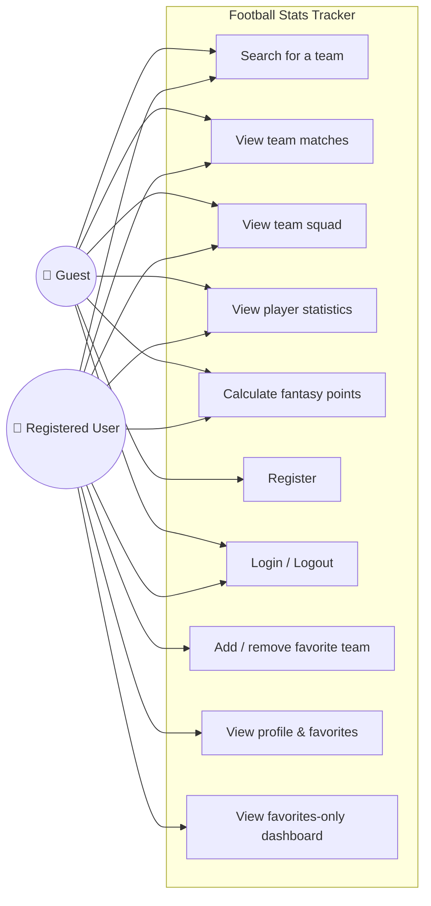
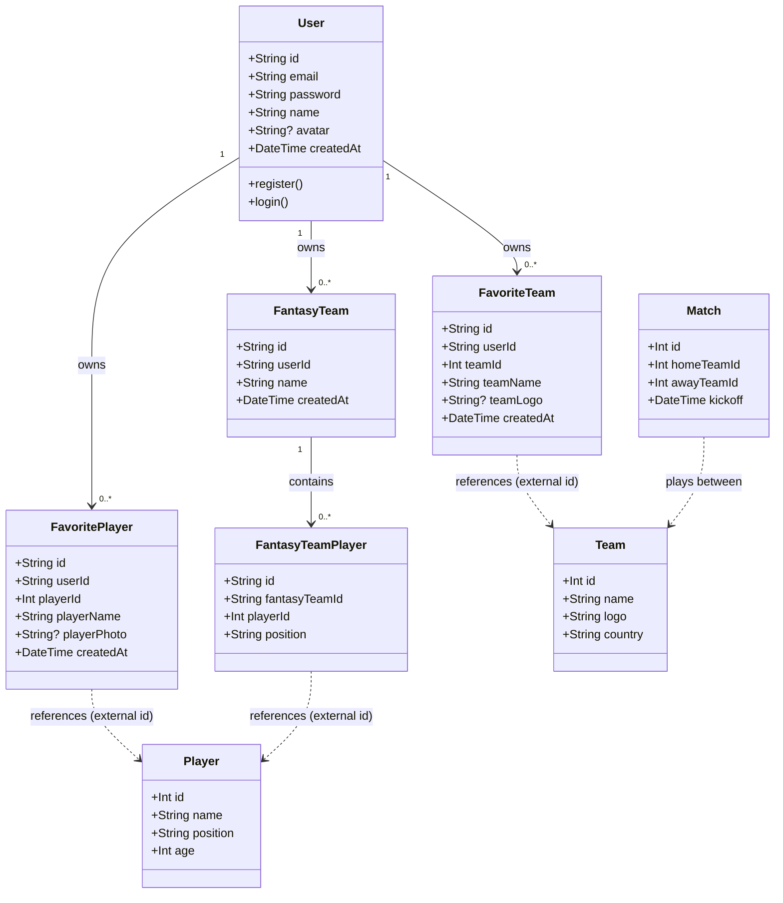
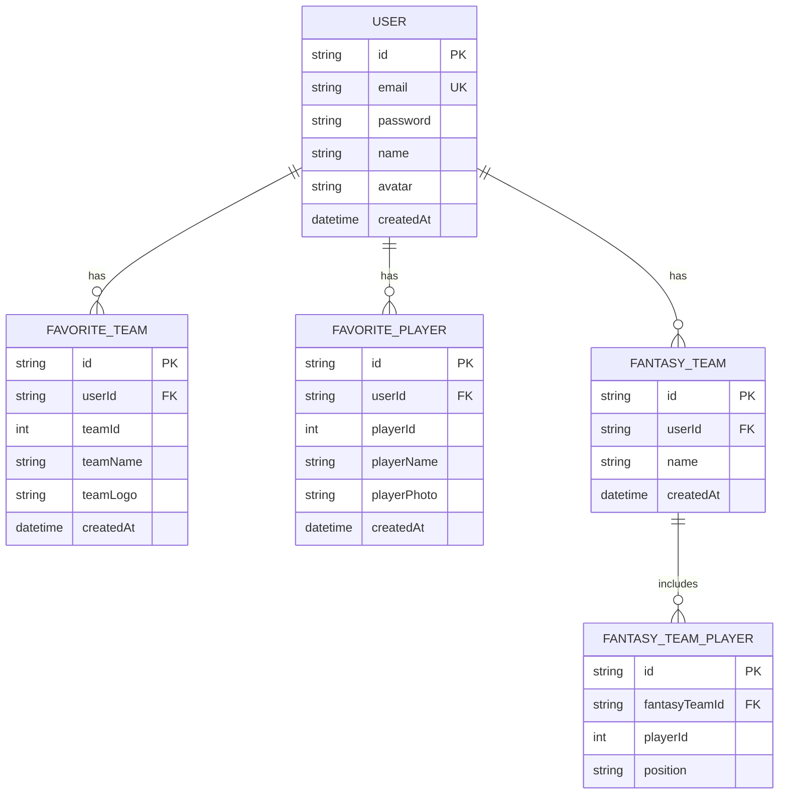

# System Design — Football Stats Tracker

UML diagrams for Phase 3, expressed in [Mermaid](https://mermaid.js.org/) so they
render directly on GitHub and in [mermaid.live](https://mermaid.live).

---

## 1. Use Case Diagram

Shows how the two actors — a **Guest** (unauthenticated) and a **Registered User** —
interact with the system. Guests can explore public football data; registered users
additionally manage an account and favorites.

**Explanation:** Public data browsing (search, matches, squad, stats, fantasy) is open
to everyone. Registration/login gate the personalized features — managing favorites,
viewing the profile, and filtering the dashboard to favorite teams only.

---

## 2. Class Diagram

Domain model of the persisted entities and their behaviors. `Match` and `Player` are
sourced live from API-Football (not stored), but appear here because favorites reference
them by external id.

**Explanation:** `User` is the aggregate root for all personalized data and owns
collections of favorites and fantasy teams. `Team`, `Player`, and `Match` are external
(API-Football) reference types — the app stores only the id plus a denormalized snapshot
(name/logo/photo) so favorites render without an extra API round-trip.

---

## 3. Entity-Relationship Diagram (ERD)

Physical database design matching `backend/prisma/schema.prisma`.

**Explanation:** All relationships are one-to-many from `USER`. `FAVORITE_TEAM` and
`FAVORITE_PLAYER` carry a composite unique constraint `(userId, teamId)` /
`(userId, playerId)` so a user cannot favorite the same entity twice. Deleting a user
cascades to their favorites and fantasy teams; deleting a fantasy team cascades to its
players.
